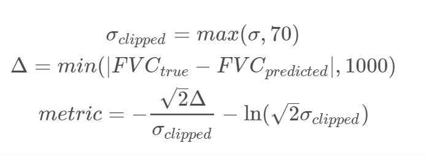

# OSIC-Pulmonary-Fibrosis-Competition
  -My score = -6.92 , First position score = -6.8305
  -https://www.kaggle.com/c/osic-pulmonary-fibrosis-progression
  -https://www.kaggle.com/c/osic-pulmonary-fibrosis-progression/data

# What is pulmonary fibrosis ? 

Pulmonary fibrosis is a lung disease that occurs when lung tissue becomes damaged and scarred. This thickened, stiff tissue makes it more difficult for you to breathe and at a severe stage makes you become progressively more short of breath.

# What we need to predict ?

We need to predict a patient’s severity of decline in lung function based on a CT scan of their lungs. Lung function is assessed based on output from a spirometer, which measures the forced vital capacity (FVC), i.e. the volume of air exhaled. The challenge is to use machine learning techniques to make a prediction with the image, metadata, and baseline FVC as input.

# Evaluation metrics :-

- The evaluation metric is a modified version of Laplace Log Likelihood. 
Predictions are evaluated with a modified version of the Laplace Log Likelihood.

# Approach :-
- Tried linear decay Resnet
- Tried EfficientNetB5
- Final predictions using Ensemble of EfficientNetB5, ElasticNet, Quantile Regression & Lasso Regression
